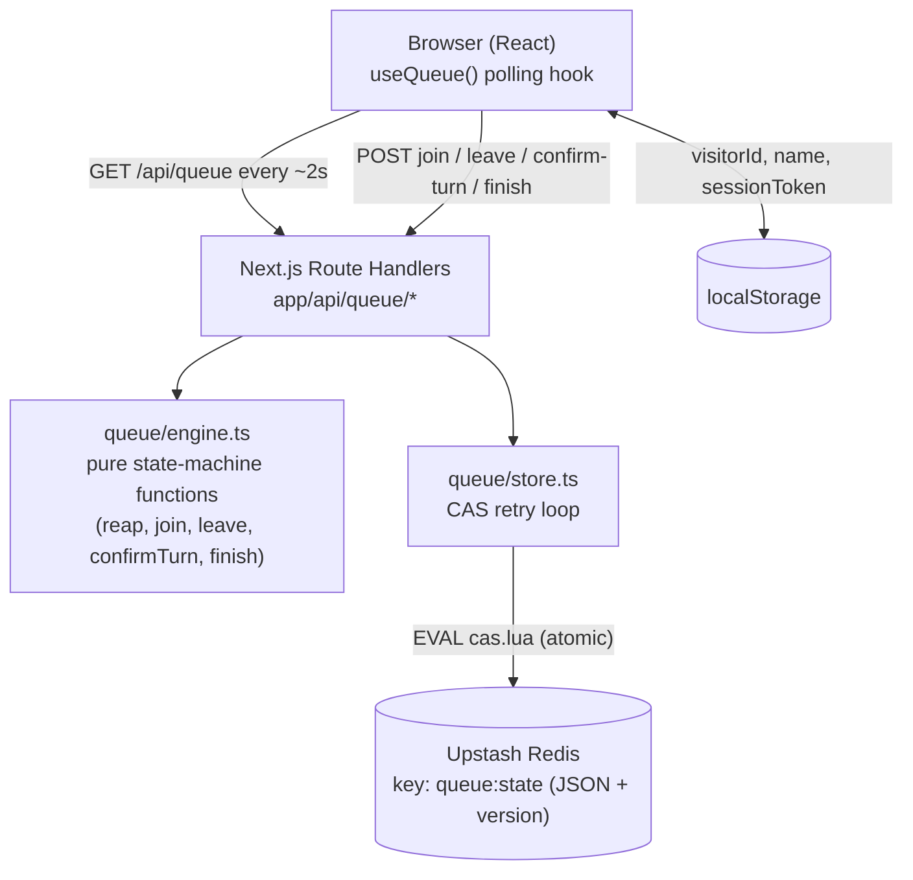
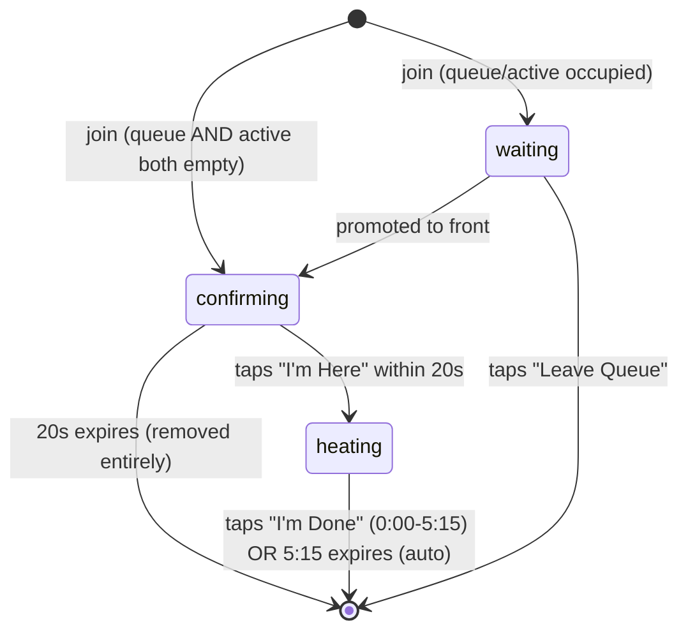

# Lunchbox Heating Queue Design

**Spec**: `.specs/features/lunchbox-queue/spec.md`
**Status**: Draft

---

## Architecture Overview

Next.js (App Router, TypeScript) deployed on Vercel, serving both the UI and the API routes from one project. All queue state lives in a single JSON object in Upstash Redis (installed via the Vercel Marketplace integration — the successor to the sunset "Vercel KV" product). There is no websocket server and no cron job: every request (a poll or an action) first *lazily reaps* any expired turn before doing anything else, which is what makes the 20s/5:15 deadlines work without a persistent timer process. Clients discover state changes and deadline expirations by polling `GET /api/queue` every ~2s (paused when the tab is hidden, with exponential backoff on failure), which comfortably beats the spec's 3-second convergence bound (QUEUE-18) without needing push infrastructure.

**Invariants** (hold across every component, not just the ones that state them locally):

- **Server is the sole source of truth.** Redis (`queue:state`) is the only authoritative copy of positions, phases, and deadlines. `localStorage` holds a visitor's own credentials (`id`, `name`, `sessionToken`) only - not queue state - and every action re-validates the token server-side regardless of what the client claims. Anything else on the client (the polled view, interpolated countdown, backoff timer) is disposable rendering cache, rebuilt from the next poll, never fed back into a server decision.
- **No response ever includes another visitor's `id`, `sessionToken`, or `sessionTokenHash`.** Enforced structurally in `view.ts` (see below) - `namesAhead` carries display names only.





---

## Code Reuse Analysis

Fresh project - no existing code, no `node_modules`, no prior conventions. Nothing to reuse yet; this design *establishes* the conventions the rest of the app follows.

### Integration Points

| System | Integration Method |
| --- | --- |
| Upstash Redis | `@upstash/redis` REST client (serverless-friendly, no TCP pooling issues) via env vars provisioned by the Vercel Marketplace integration |
| Vercel domains | `marmiflix.cruz.dev.br` added as a custom domain in the Vercel project's Domains settings; a CNAME (or Vercel-provided ALIAS/A record) added at the `cruz.dev.br` DNS host - standard flow, no app-code impact |

---

## Components

### `lib/queue/types.ts`

- **Purpose**: Shared TypeScript types for the queue domain.
- **Location**: `lib/queue/types.ts`
- **Interfaces**:
  - `type Phase = 'waiting' | 'confirming' | 'heating'`
  - `interface WaitingEntry { id: string; name: string; sessionTokenHash: string; joinedAt: number }`
  - `interface ActiveEntry { id: string; name: string; sessionTokenHash: string; phase: 'confirming' | 'heating'; phaseStartedAt: number; deadline: number }`
  - `interface QueueState { version: number; active: ActiveEntry | null; waiting: WaitingEntry[] }`
- **Dependencies**: none
- **Reuses**: n/a

### `lib/queue/engine.ts`

- **Purpose**: Pure, unit-testable state-machine functions implementing every QUEUE-* rule. No I/O - takes a state, returns a new state or throws a typed domain error.
- **Location**: `lib/queue/engine.ts`
- **Interfaces**:
  - `reapExpired(state: QueueState, now: number): QueueState` - if `active` exists and `now > active.deadline`, resolves it (confirming timeout → drop entirely; heating timeout → drop, turn complete) and promotes the next `waiting` entry into `active` with a **fresh** deadline computed from `now` (QUEUE-11, QUEUE-15, QUEUE-17).
  - `applyJoin(state, { name, id, sessionTokenHash }, now): QueueState` - throws `DuplicateNameError` if the trimmed, case-insensitive name matches any active/waiting entry (QUEUE-20). If `active === null` and `waiting` is empty, the new entry becomes `active` in `confirming` phase immediately (QUEUE-02). Otherwise appended to `waiting` (QUEUE-03, QUEUE-04).
  - `applyLeave(state, { id, sessionTokenHash }): QueueState` - throws `NotFoundError` / `ForbiddenError`; removes a `waiting` entry only (QUEUE-06). Leaving while `active` is not supported by the UI (the active user only ever taps "I'm Done"), so this rejects with `WrongPhaseError` if `id` matches `active`.
  - `applyConfirmTurn(state, { id, sessionTokenHash }, now): QueueState` - throws if `id` isn't `active` in `confirming` phase, or on token mismatch; transitions `active.phase` to `heating` with `phaseStartedAt = now`, `deadline = now + 5m15s` (QUEUE-10).
  - `applyFinishHeating(state, { id, sessionTokenHash }, now): QueueState` - throws if `id` isn't `active` in `heating` phase, or on token mismatch; clears `active` and promotes the next `waiting` entry into `confirming` with a fresh deadline (QUEUE-14, QUEUE-17).
- **Dependencies**: `types.ts`
- **Reuses**: n/a

### `lib/queue/store.ts`

- **Purpose**: All Redis I/O and the atomicity guarantee. Nothing outside this file talks to Redis.
- **Location**: `lib/queue/store.ts`
- **Interfaces**:
  - `casWrite(key: string, expectedVersion: number, next: QueueState): Promise<boolean>` - runs the generic CAS Lua script via `redis.eval(...)`.
  - `withQueueMutation<T>(mutate: (state: QueueState, now: number) => { next: QueueState; result: T }): Promise<T>` - GET current state (default empty state if key missing) → `reapExpired` → `mutate` → bump `version` → `casWrite`; on CAS failure (concurrent writer), retry from GET up to 5 times with a small random backoff; throws `QueueBusyError` if exhausted.
- **Dependencies**: `@upstash/redis`, `engine.ts`, `types.ts`
- **Reuses**: n/a

**CAS Lua script** (the only Lua in the project - deliberately generic and tiny so it's easy to verify by reading it, unlike embedding the whole state machine in Lua):

```lua
-- KEYS[1] = state key, ARGV[1] = expected version, ARGV[2] = new JSON value
local current = redis.call('GET', KEYS[1])
local currentVersion = "0"
if current then
  local ok, decoded = pcall(cjson.decode, current)
  if ok and decoded.version then currentVersion = tostring(decoded.version) end
end
if currentVersion == ARGV[1] then
  redis.call('SET', KEYS[1], ARGV[2])
  return 1
else
  return 0
end
```

### `lib/queue/view.ts`

- **Purpose**: Shapes the raw `QueueState` into what a specific viewer should see - enforces the never-leak-another-visitor's-`id`/`sessionTokenHash` invariant by construction (it is the *only* place a `QueueView` gets built, and it never copies `id` or `sessionTokenHash` for any entry except the caller's own), computes the caller's own position/ETA/deadline if they have an active entry, and the pre-join landing stats (QUEUE-01) otherwise.
- **Location**: `lib/queue/view.ts`
- **Interfaces**: `buildView(state: QueueState, viewerId: string | null, now: number): QueueView` (public fields only: `queueCount`, `estimatedWaitMs`, `namesAhead: string[]`, `self: { phase, position?, deadline?, ... } | null`, `serverTime: number`).
- **Dependencies**: `types.ts`
- **Reuses**: n/a

### `lib/identity.ts`

- **Purpose**: Client-side only. Owns the visitor's `id`, `name`, and `sessionToken` in `localStorage`, so a reload resumes their own view (QUEUE-07) and the raw token never needs to touch a cookie or server session store.
- **Location**: `lib/identity.ts`
- **Interfaces**: `getIdentity()`, `setIdentity({ id, name, sessionToken })`, `clearIdentity()`.
- **Dependencies**: `localStorage`
- **Reuses**: n/a

### API Route Handlers (`app/api/queue/*`)

- **Purpose**: Thin HTTP layer translating requests into `store.ts` calls and domain errors into status codes.
- **Location**: `app/api/queue/route.ts` (GET), `app/api/queue/join/route.ts`, `.../leave/route.ts`, `.../confirm-turn/route.ts`, `.../finish/route.ts`
- **Interfaces**: standard Next.js Route Handlers (`GET`, `POST`).
- **Dependencies**: `store.ts`, `view.ts`, `engine.ts` (for error types), `rate-limit.ts`
- **Reuses**: n/a
- Server generates `sessionToken` on `join` as `crypto.randomBytes(32).toString('base64url')` (256-bit secret, independent of `id` - `id` is a plain identifier, never treated as a credential), returns the token once in the response body, and stores only `sha256(sessionToken)` server-side.
- Token verification uses `crypto.timingSafeEqual` on the hash bytes, never `===` on the raw string, so response timing can't leak which prefix bytes are correct.
- **Invariant (enforced by `view.ts`, see below): no response - to any caller, at any endpoint - ever includes another visitor's `id`, `sessionToken`, or `sessionTokenHash`.** `namesAhead` carries display names only.
- Every mutating route (`join`, `leave`, `confirm-turn`, `finish`) calls `rate-limit.ts` before touching `store.ts`; a caller over the limit gets 429 before any Redis read/write happens.

### `lib/queue/rate-limit.ts`

- **Purpose**: Blunt, cheap abuse guard so a scripted loop (token-guessing or otherwise) against the mutating endpoints gets shut down instead of hammering Redis or brute-forcing a token.
- **Location**: `lib/queue/rate-limit.ts`
- **Interfaces**: `checkRateLimit(key: string, limit = 10, windowSeconds = 10): Promise<boolean>` - `INCR` a `ratelimit:{key}` Redis key, `EXPIRE` it on first increment, return `false` (caller should 429) once the count exceeds `limit` within the window.
- **Usage**: keyed by `id` for `leave`/`confirm-turn`/`finish` (an attacker guessing tokens for one target id gets capped fast); keyed by request IP (`x-forwarded-for`) for `join`, which has no `id` yet.
- **Dependencies**: `@upstash/redis`
- **Reuses**: same Redis instance as `store.ts`, different key namespace

### `hooks/useQueue.ts`

- **Purpose**: Owns the polling loop, the shared network-health signal, and local countdown rendering.
- **Location**: `hooks/useQueue.ts`
- **Interfaces**: `useQueue(): { view: QueueView | null; connection: 'ok' | 'down'; actions: { join, leave, confirmTurn, finish } }`
- **Behavior**: polls `GET /api/queue` every 2000ms; pauses while `document.hidden` (Page Visibility API) and resumes immediately on visibility regain; uses the response's `serverTime` to compute a client/server clock offset so on-screen countdowns tick smoothly between polls instead of jumping.
- **Network-health signal**: every queue API call (the poll, and every action in `actions`) goes through one shared request wrapper. A transport-level failure (network error, timeout, 5xx) increments a `consecutiveFailures` counter and drives the same exponential backoff (2s → 4s → 8s → 16s → capped at 30s) for whatever request is next due. A domain-level response (403/409/429 - the server answered, it just said no) does **not** increment the counter - it means the server is reachable. Any successful response resets `consecutiveFailures` to 0 and the backoff to 2s.
- **Down state**: once `consecutiveFailures >= 4` (backoff has reached its 30s cap, ~14s of continuous failure), `connection` flips to `'down'`. Retries keep running in the background at the capped interval; the moment one succeeds, `connection` flips back to `'ok'` automatically - no reconnect transition logic needed, since the next successful poll just delivers the current server-side phase like any other poll.
- **Dependencies**: `lib/identity.ts`
- **Reuses**: n/a

### UI Screens (`app/*`)

- **Purpose**: Landing, Waiting, ConfirmTurn, Heating - one component per phase, all copy in pt-BR (QUEUE-23).
- **Location**: `app/page.tsx` + `components/queue/*`
- **Dependencies**: `hooks/useQueue.ts`, Tailwind CSS, Framer Motion (phase transitions), `canvas-confetti` (celebration burst on entering ConfirmTurn, alongside `navigator.vibrate` where supported - QUEUE-12)
- **Reuses**: n/a

### `components/queue/ErrorScreen.tsx`

- **Purpose**: Full-screen connection-lost state, shown instead of whatever phase screen was active, for any phase (home/waiting/confirm-turn/heating) alike.
- **Location**: `components/queue/ErrorScreen.tsx`, rendered by the app shell (`app/page.tsx`) at the top level: `connection === 'down' ? <ErrorScreen onRetryNow={...} /> : <PhaseScreen view={view} />` - one conditional, no per-screen changes needed.
- **Content (pt-BR)**: "Sem conexão com o servidor" headline, reassurance that the visitor's place in the queue is safe (it's server-side, not lost locally), a spinner/indicator that it's retrying automatically, and a "Tentar agora" button that triggers an immediate retry instead of waiting out the remaining backoff delay.
- **Dependencies**: `hooks/useQueue.ts` (`connection` state, a manual retry trigger)
- **Reuses**: n/a

---

## Data Models

### `QueueState` (single Redis key: `queue:state`)

```typescript
interface QueueState {
  version: number
  active: ActiveEntry | null
  waiting: WaitingEntry[]
}

interface WaitingEntry {
  id: string           // crypto.randomUUID(), generated server-side on join
  name: string          // display name as entered, trimmed
  sessionTokenHash: string
  joinedAt: number       // epoch ms
}

interface ActiveEntry {
  id: string
  name: string
  sessionTokenHash: string
  phase: 'confirming' | 'heating'
  phaseStartedAt: number  // epoch ms, when this phase began
  deadline: number         // epoch ms; phaseStartedAt + 20_000 (confirming) or + 315_000 (heating)
}
```

**Relationships**: `active` is the single front-of-queue slot; `waiting` is FIFO ordered by `joinedAt` (array order = queue order). No separate "done" record is persisted (QUEUE entries are ephemeral per the spec's no-history assumption).

---

## Error Handling Strategy

| Error Scenario | Handling | User Impact |
| --- | --- | --- |
| Duplicate active name on join | `applyJoin` throws `DuplicateNameError` → 409 | Toast (pt-BR): "Esse nome já está na fila" |
| Action targets an id no longer in state (already reaped/removed) | `NotFoundError` → 404 | Client clears local identity and returns to landing |
| `sessionToken` doesn't match the entry's `sessionTokenHash` | `ForbiddenError` → 403 | Same as above - treated as "this isn't really you" |
| Action attempted in the wrong phase (e.g. "confirm-turn" on a `waiting` entry) | `WrongPhaseError` → 409 | Client re-syncs from the next poll and re-renders the correct screen |
| CAS retries exhausted (5x concurrent writers) | `QueueBusyError` → 503 | pt-BR "Fila ocupada, tentando novamente..." + immediate client retry with backoff |
| Caller exceeds the rate limit on a mutating endpoint (token-guessing or scripted abuse) | `rate-limit.ts` returns 429 before any Redis read/write | Rejected silently from the attacker's point of view (no distinction shown between "wrong token" and "rate limited"); a legitimate user hitting this by accident just retries after the window via the same backoff logic |
| Redis unreachable / Upstash error | 502 | Counts toward `consecutiveFailures` like any transport failure; polling keeps retrying with the same exponential backoff |
| Backoff reaches its 30s cap and keeps failing (4+ consecutive transport failures - server/Redis genuinely unreachable) | `useQueue`'s `connection` flips to `'down'` | Full-screen `ErrorScreen` replaces whatever phase screen was showing, at any stage (home/waiting/confirm-turn/heating); background retries continue at the capped interval and a manual "Tentar agora" forces an immediate one; the moment any request succeeds, `connection` flips back to `'ok'` and the normal phase screen resumes automatically |

---

## Risks & Concerns

| Concern | Location | Impact | Mitigation |
| --- | --- | --- | --- |
| No login: a display name is, by itself, guessable/typeable by anyone with the URL | `app/api/queue/*` | Someone could otherwise act on another visitor's entry (end their turn early, leave for them) | Opaque 256-bit `sessionToken` issued server-side at join, only `sha256(token)` stored server-side, required on every mutating action against that entry (see API Route Handlers) |
| A visitor tampering with their *own* stored `sessionToken` (e.g. via devtools, out of curiosity or as a prank) | `lib/identity.ts` (client-side) | Their own next action gets 403'd and their entry becomes orphaned - but this is exactly equivalent to simply not pressing the button, which the 20s/5:15 deadlines already handle | No new barrier needed; bounded by the existing timeout logic in `reapExpired`. Worth a clearer client-side message ("sua sessão expirou, sua vaga será liberada automaticamente") instead of silently returning to landing, so it doesn't read as a mysterious bug |
| Timing side-channel on token verification, or a scripted loop guessing tokens for a specific `id` | `app/api/queue/*` token check | In principle lets a technical employee try to hijack someone else's entry (end their turn, remove them) purely by guessing | `crypto.timingSafeEqual` for the hash comparison (never `===`) + `rate-limit.ts` capping attempts per `id`/IP; 256 bits of entropy in the token makes brute force infeasible regardless, this is defense in depth |
| Sustained polling if a tab is left open unattended for hours | `hooks/useQueue.ts` | Unnecessary request volume against Upstash's free-tier quota | Poll only while the tab is visible (Page Visibility API); exponential backoff on failure; single small JSON GET per request keeps per-poll cost minimal. If usage ever outgrows this, swap to the push-based Supabase Realtime approach considered during Design |
| Single Redis key = single write-contention point | `lib/queue/store.ts` | A burst of simultaneous actions could hit CAS retries | Office-scale traffic (a handful of people acting within the same second, at most) makes this a non-issue in practice; the 5x bounded retry with backoff exists specifically for this |
| Client/server clock skew | `hooks/useQueue.ts` | Countdown timers could visibly drift from the server's actual deadline | Every response carries `serverTime`; client computes remaining time as `deadline - (serverTime + elapsedSincePoll)`, never from the client's own clock alone |

---

## Tech Decisions

| Decision | Choice | Rationale |
| --- | --- | --- |
| Framework | Next.js (App Router) + TypeScript, on Vercel | Vercel's own framework; ships UI + API routes from a single deployable, matches "start simple" |
| Data store | Upstash Redis via the Vercel Marketplace integration (successor to the sunset "Vercel KV") | One JSON blob is a natural fit for a single global queue; `@upstash/redis`'s REST client avoids the TCP connection-pooling problems a normal Redis client has on serverless |
| Atomicity | Optimistic concurrency: a `version` field + a tiny generic CAS Lua script, instead of embedding the whole state machine in Lua | Keeps the actual queue rules (`engine.ts`) in plain, unit-testable TypeScript; the only Lua in the project is 8 lines, easy to verify by reading it |
| Realtime delivery | Polling `GET /api/queue` every ~2s, paused when hidden, exponential backoff on failure | Meets the spec's 3s convergence bound (QUEUE-18) with zero extra infrastructure; explicitly the first thing to swap for push (Supabase Realtime) if traffic ever demands it |
| Visitor identity | Name + opaque per-browser `sessionToken` in `localStorage`, no login | Matches the spec's "simplest way" identification assumption while closing the same-name-hijack gap |
| Session token generation & verification | `crypto.randomBytes(32)` (256-bit secret, separate from the entry's `id`), stored server-side only as a SHA-256 hash, compared with `crypto.timingSafeEqual` | `id` is a label, not a credential - conflating the two was the original gap; constant-time comparison closes the timing side-channel a curious/technical employee could otherwise poke at |
| Abuse / brute-force guard | Fixed-window Redis rate limit (`INCR`+`EXPIRE`, ~10 req/10s) on every mutating endpoint, keyed by `id` (or IP for `join`) | Cheap, no new infra (same Redis instance); caps both token-guessing attempts and generic scripted abuse before it reaches `store.ts` |
| Styling / animation | Tailwind CSS + Framer Motion + `canvas-confetti` | Standard, well-documented, lightweight libraries; confetti + spring transition delivers the "really cool animation" requirement without custom animation code |
| Domain | `marmiflix.cruz.dev.br` added as a Vercel custom domain, DNS record at the `cruz.dev.br` host | Standard Vercel flow; no app-code impact |
| Sustained-outage handling | A single shared `connection: 'ok' \| 'down'` signal in `useQueue` (4+ consecutive transport failures) renders one app-shell-level `ErrorScreen` instead of the current phase screen, recovering automatically on the next successful request | Works "at any stage" for free (one conditional at the shell level, no per-screen special-casing); domain errors (403/409/429) are excluded from the signal since they prove the server is actually reachable |

> **Project-level decision:** the stack + atomicity + polling choices above are foundational for the whole app (there's nothing else in this project yet), so they're also being logged as `AD-001` in `.specs/STATE.md`.
