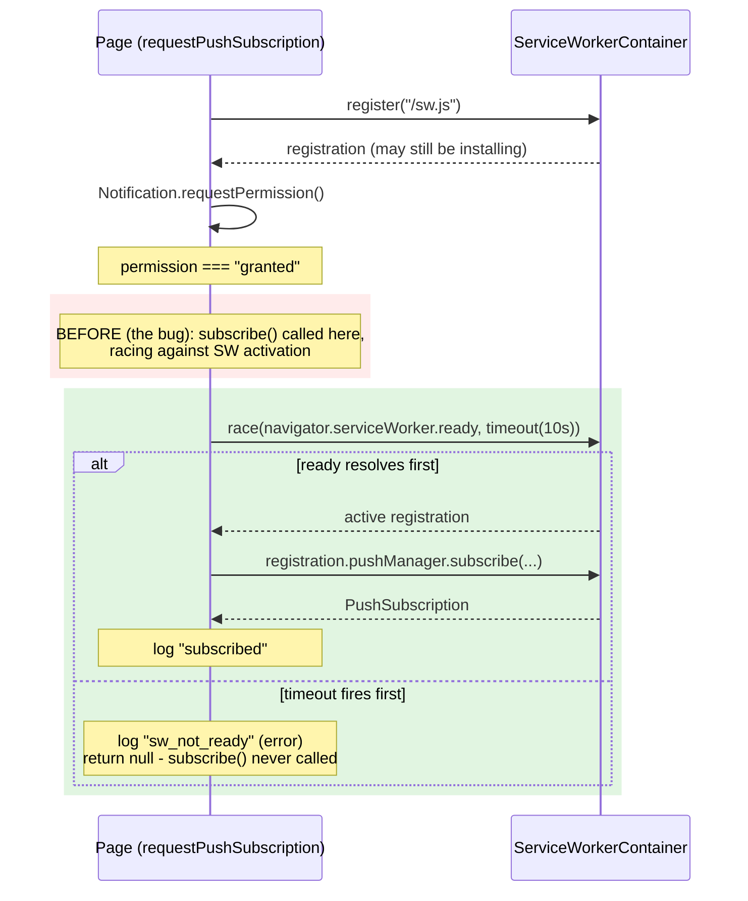

# Push Subscription Service-Worker-Ready Race Design

**Spec**: `.specs/features/push-subscription-sw-ready/spec.md`
**Status**: Draft

---

## Architecture Overview

Single function change, no new files, no new components. `requestPushSubscription()` gains one step between "permission granted" and "call `pushManager.subscribe()`": wait for the service worker registration to become active, bounded by a timeout.



---

## Code Reuse Analysis

### Existing Components to Leverage

| Component | Location | How to Use |
| --- | --- | --- |
| `logSubscriptionOutcome` + `OUTCOME_LOG_LEVEL` | `lib/notifications/client.ts` | Add one new key (`sw_not_ready` → `"error"`); no change to the logging mechanism itself. |
| Outer `try { ... } catch` in `requestPushSubscription` | `lib/notifications/client.ts` | Unchanged - still the catch-all for `register()` rejecting or `subscribe()` throwing after activation. The new wait step resolves to `null` on timeout rather than throwing, so it deliberately does **not** fall into this catch (see Risks). |
| `PushSubscriptionRecord` type | `lib/queue/types.ts` | Unchanged - return type of the function is untouched. |

### Integration Points

None - this is a self-contained client-side timing fix. No server, no API contract, no new dependency.

---

## Components

### `requestPushSubscription` (modified)

- **Purpose**: Same as today - register the SW, request permission, obtain a push subscription; now additionally waits for the SW to be active before subscribing.
- **Location**: `lib/notifications/client.ts`
- **Interfaces**: Signature unchanged - `(): Promise<PushSubscriptionRecord | null>`.
- **Dependencies**: `navigator.serviceWorker.ready`, `setTimeout`/`clearTimeout` (both already implicitly available in this browser-only module).
- **Reuses**: Everything above.

### `waitForActiveServiceWorker` (new, private helper)

- **Purpose**: Race `navigator.serviceWorker.ready` against a timeout; resolve to the active `ServiceWorkerRegistration` on success or `null` on timeout. Never rejects.
- **Location**: `lib/notifications/client.ts` (module-private, not exported - same visibility as the existing `logSubscriptionOutcome`/`urlBase64ToUint8Array` helpers).
- **Interfaces**:
  - `waitForActiveServiceWorker(timeoutMs: number): Promise<ServiceWorkerRegistration | null>`
- **Dependencies**: `navigator.serviceWorker.ready`.
- **Reuses**: n/a (new logic, but trivially small - a single `Promise.race`-shaped wrapper).

**Sketch** (shape, not final code - Execute owns the literal implementation):

```typescript
const SW_READY_TIMEOUT_MS = 10_000;

function waitForActiveServiceWorker(timeoutMs: number): Promise<ServiceWorkerRegistration | null> {
  return new Promise((resolve) => {
    let settled = false;
    const timer = setTimeout(() => {
      if (!settled) {
        settled = true;
        resolve(null);
      }
    }, timeoutMs);

    navigator.serviceWorker.ready.then((registration) => {
      if (!settled) {
        settled = true;
        clearTimeout(timer);
        resolve(registration);
      }
    });
  });
}
```

`requestPushSubscription` calls `pushManager.subscribe()` on the registration **returned by `waitForActiveServiceWorker`** (i.e., the one `ready` resolved with), not the possibly-still-installing one `register()` returned - they're the same registration in this app (single SW at scope `/`), but sourcing the call site from the confirmed-active object is the more correct pattern and costs nothing extra.

---

## Data Models

None - no new types. `OUTCOME_LOG_LEVEL`'s key type is already `string` (`Record<string, "info" | "warn" | "error">`), so adding `sw_not_ready` is a value-level change, not a type change.

---

## Error Handling Strategy

| Error Scenario | Handling | User Impact (log outcome) |
| --- | --- | --- |
| SW registration never reaches active within 10s | `waitForActiveServiceWorker` resolves `null`; function logs `sw_not_ready` (error) and returns `null` - `subscribe()` is never called | No push subscription this attempt; same as today's other silent-`null` failure paths (e.g. `permission_denied`) - no thrown error surfaces to the caller |
| SW registration becomes active before the timeout, then `subscribe()` throws anyway (e.g. `NotAllowedError`, malformed key) | Unchanged - caught by the existing outer `catch`, logs `subscribe_failed` (error) | Same as today |
| `navigator.serviceWorker.register()` itself rejects | Unchanged - existing outer `catch`, logs `subscribe_failed` | Same as today - the new wait step is never reached |

---

## Risks & Concerns

| Concern | Location (file:line) | Impact | Mitigation |
| --- | --- | --- | --- |
| `navigator.serviceWorker.ready` is not spec-guaranteed to settle if the registration becomes `redundant` before activating | New `waitForActiveServiceWorker` helper | Without a bound, a pathological install failure could hang the subscribe attempt forever with no error and no log | The 10s timeout (spec SWREADY-03) - this is the entire reason the timeout exists, not an afterthought |
| Test suite (`lib/notifications/__tests__/client.test.ts`) has no existing fake-timer usage | `lib/notifications/__tests__/client.test.ts` | A naive test of the timeout path would either really wait 10s (slow, flaky under CI load) or need careful async/fake-timer coordination | Tasks phase calls for `vi.useFakeTimers()` scoped to the new timeout-path test(s) only, restored afterward - a well-established Vitest pattern, not a new one for this codebase to invent |
| A dangling `setTimeout` if `ready` resolves first (not the timeout) | `waitForActiveServiceWorker` | Negligible - a browser tab's JS context doesn't leak in a way that matters here, but a live timer callback firing after resolution would be wasted work | `settled` flag + explicit `clearTimeout` in the sketch above - already designed in, called out here so Tasks doesn't drop it as "simplification" |

---

## Tech Decisions (only non-obvious ones)

| Decision | Choice | Rationale |
| --- | --- | --- |
| Bounded vs. unbounded wait for SW activation | Bounded (10s timeout) | User-confirmed during Specify (see spec's Assumptions table) - trades a theoretical indefinite hang for a bounded, observable failure |
| Where the timeout constant lives | Local `const` in `lib/notifications/client.ts`, not `lib/queue/config.ts` | AD-003 centralizes **env-var reads**, not arbitrary in-code constants - this isn't configurable via environment, it's a fixed implementation detail of the wait strategy, so it doesn't fall under that decision's scope |
| Which registration object calls `.subscribe()` | The one resolved by `navigator.serviceWorker.ready`, not the one returned by `.register()` | More correct - guaranteed active - at zero extra cost, even though in this single-SW-scope app they're the same object in practice |

No new project-level `AD-NNN` entry needed - this is a local implementation decision within the existing `AD-002` push-notification architecture, not a new convention future features must follow.
